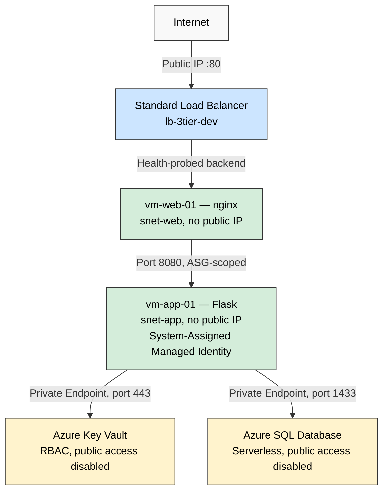

# Azure 3-Tier Secure Network Architecture

A self-directed cloud security project: designing, building, and validating a defense-in-depth 3-tier network architecture on Microsoft Azure — first manually, then rebuilt as version-controlled Infrastructure as Code with automated threat detection and a secretless CI/CD pipeline.

## Overview

This project demonstrates hands-on cloud security engineering beyond coursework and certification study — applying real network segmentation, least-privilege identity, private connectivity, and monitoring practices to a fully built, fully validated architecture. Every security boundary was tested empirically, not assumed: real connectivity failures were diagnosed and resolved, real security gaps were identified and closed, and the resulting build reflects actual operational experience, not a tutorial walkthrough.

## Project Phases

This project was built in two deliberate phases, each with its own complete documentation:

| Phase | What | Status |
|---|---|---|
| **Phase 1** | Manual build via Azure Portal/CLI — the architecture itself, hand-built to deliberately encounter real operational friction | ✅ Complete |
| **Phase 2** | Full Terraform rebuild, Microsoft Sentinel threat detection, OIDC-secured CI/CD pipeline, Defender for Cloud CSPM | ✅ Complete |

Full phase-by-phase build notes for both live in [`docs/`](./docs).

## Table of Contents

- [Overview](#overview)
- [Project Phases](#project-phases)
- [Phase 1: Manual Build](#phase-1-manual-build)
  - [Architecture](#architecture)
  - [Tech Stack](#tech-stack)
  - [Security Controls Implemented](#security-controls-implemented)
  - [Validation Results](#validation-results)
  - [Lessons Learned](#lessons-learned)
  - [Reproducing This Build](#reproducing-this-build)
  - [Cost Analysis](#cost-analysis)
- [Phase 2: Infrastructure as Code, Detection Engineering & CI/CD](#phase-2-infrastructure-as-code-detection-engineering--cicd)
  - [Terraform Rebuild](#terraform-rebuild)
  - [Threat Detection with Microsoft Sentinel](#threat-detection-with-microsoft-sentinel)
  - [Secretless CI/CD Pipeline](#secretless-cicd-pipeline)
  - [Cloud Security Posture Management](#cloud-security-posture-management)
- [Current Status](#current-status)
- [About](#about)

## Phase 1: Manual Build

## Architecture

**Design principle:** the Load Balancer is the only public IP in the entire architecture. Every other resource — both VMs, Key Vault, and SQL Database — has zero direct internet exposure. Each hop enforces its own network boundary via NSGs and Application Security Groups.

## Tech Stack

| Layer | Technology |
|---|---|
| Compute | Azure Virtual Machines (Ubuntu 22.04/24.04, Arm64, B-series burstable) |
| Web tier | nginx (reverse proxy) |
| Application tier | Python 3.12, Flask, pyodbc |
| Data tier | Azure SQL Database (serverless, always-free tier) |
| Secrets | Azure Key Vault (RBAC, Private Endpoint) |
| Identity | System-assigned Managed Identity, `DefaultAzureCredential` |
| Networking | VNet, NSGs, Application Security Groups, Private Endpoints, Private DNS Zones |
| Load balancing | Azure Standard Load Balancer |
| Monitoring | Azure Monitor, Log Analytics, Virtual Network Flow Logs, SQL Auditing |
| IaC / Tooling | Azure CLI, Azure Portal |

## Security Controls Implemented

- **Zero public IPs on workload VMs** — `vm-web-01` and `vm-app-01` are unreachable from the internet by design. The Load Balancer is the sole public entry point.
- **Network segmentation via NSGs and Application Security Groups** — each subnet (`snet-web`, `snet-app`, `snet-data`) enforces its own inbound rules, scoped to specific ASG membership rather than broad IP ranges. Web-to-app traffic is permitted only from `asg-web` on port 8080; all other inbound traffic is explicitly denied.
- **Managed identity authentication — no stored credentials** — `vm-app-01` authenticates to Key Vault using a system-assigned managed identity via `DefaultAzureCredential`. No password, connection string, or API key is stored in code, configuration, or environment variables.
- **Least-privilege identity scope** — only `vm-app-01` (the tier that requires database and secrets access) holds a managed identity. `vm-web-01` has no identity, no stored credentials, and no direct path to Key Vault or SQL. This holds by design even as the web tier's responsibilities grow: Layer 7 capabilities like a WAF, rate limiting, or TLS termination operate on request content, not backend credentials — so `vm-web-01` can absorb that additional security responsibility without ever needing authenticated access to the data layer.
- **Private connectivity for all PaaS services** — both Key Vault and Azure SQL Database are reachable only via Private Endpoint, with public network access explicitly disabled at the resource level. DNS resolution for both services routes through Private DNS Zones linked to the VNet, ensuring traffic never traverses the public internet even when the underlying resource resides in a different Azure region.
- **Layered access verification** — Key Vault and SQL Database access is controlled independently at multiple layers: RBAC role assignment (`Key Vault Secrets User`), network isolation (Private Endpoint), and — for SQL specifically — native database auditing, confirmed to log every connection attempt with source IP, host, and success/failure status.
- **Auto-shutdown and cost governance** — all compute resources are configured with scheduled auto-shutdown, and a subscription-level budget alert (with tightened thresholds) provides ongoing cost visibility throughout the build.

## Validation Results

Every security boundary in this architecture was tested empirically rather than assumed. The matrix below reflects actual test results from live validation sessions, including a real production-style incident encountered and resolved mid-testing.

### Connectivity Matrix

| # | Test | Expected | Actual | Result |
|---|---|---|---|---|
| 1 | Internet → Load Balancer → full request chain | 200 OK | 200 OK | ✅ Pass |
| 2 | Internet → `vm-web-01` direct (private IP) | Unreachable | `TcpTestSucceeded: False` | ✅ Pass |
| 3 | Internet → `vm-app-01` direct (private IP) | Unreachable | `TcpTestSucceeded: False` | ✅ Pass |
| 4a | Internet → SQL Server, raw TCP handshake | N/A | `TcpTestSucceeded: True` | ℹ️ Expected — Azure SQL's gateway layer accepts the initial handshake for all databases regardless of access configuration |
| 4b | Internet → SQL Server, actual authentication attempt | Rejected | Connection failed at login layer | ✅ Pass — confirms the real security boundary (`publicNetworkAccess: Disabled`) is enforced past the gateway |
| 5 | `vm-web-01` → `vm-app-01` on port 8080 (allowed path) | Success | Success (after incident resolution — see below) | ✅ Pass |
| 6 | Managed identity → Key Vault secret retrieval | Success | Confirmed via direct test script and production traffic | ✅ Pass |
| 7 | `vm-app-01` → Azure SQL via Private Endpoint | Success | Confirmed via `sqlcmd` and application traffic | ✅ Pass |

### Incident: ASG Membership Does Not Persist Across VM Restarts

During validation, a routine VM stop/start cycle caused the public-facing endpoint to fail. Root-cause analysis, conducted systematically rather than by guesswork:

1. Confirmed both VMs were running (ruled out power state)
2. Confirmed the Flask application was healthy via direct connection to `vm-app-01` (ruled out the application tier)

### Finding: SQL Diagnostic Settings Conflict

Initial SQL audit logging was configured via the standard Azure Diagnostic Settings feature, pointed at the project's Log Analytics workspace. Despite showing as correctly configured, no audit data appeared even after generating confirmed real database traffic.

Root cause: Azure SQL Database auditing has its own dedicated configuration mechanism (`az sql db audit-policy`), separate from the generic Diagnostic Settings feature used for other resources in this project (e.g., VNet flow logs). The Diagnostic Settings entry only defined a data *destination* — it did not enable the SQL engine's native auditing feature, which is what actually generates the events. Attempting to configure both simultaneously produced a `Conflict` error, since each mechanism attempted to claim the same Log Analytics workspace as its target. Resolved by removing the generic diagnostic setting and configuring the audit policy directly with its own explicit Log Analytics target.

### Finding: Traffic Analytics Coverage Gap

Virtual Network flow logs reliably captured traffic crossing the VNet boundary to Azure public service endpoints (Key Vault, SQL via Private Link), with full attribution down to source VM, NIC, and subnet. However, intra-VNet traffic between subnets — specifically the web-to-app tier communication verified in Test #5 — did not appear in Traffic Analytics (`NTANetAnalytics`), despite the flow log being correctly scoped to the entire VNet and using Microsoft's documented query pattern for subnet-pair analysis.

This is a documented limitation observed in this environment, and it reinforces a practical lesson: **automated telemetry should not be the sole source of truth for validating security controls.** The ASG-related incident above was diagnosed and confirmed using direct connectivity testing precisely because Traffic Analytics did not surface it.

## Lessons Learned

Beyond the specific incidents documented above, this build surfaced several practical lessons in working with Azure at a level deeper than typical tutorial-following:

- **Region capacity is not the same as subscription quota.** A confirmed, non-zero quota for a VM size or service does not guarantee actual datacenter capacity is available at deployment time. This was encountered independently with both Azure SQL Database (blocked from deploying in the originally planned region despite no quota restriction) and VM sizing (an x64 B-series VM failed with `SkuNotAvailable` despite showing 0/4 quota used) — resolved by checking live SKU availability via `az vm list-skus` rather than relying on quota figures alone.

- **Not all portal-suggested defaults are the safest choice.** Deploying Azure Bastion through the portal's guided flow resulted in a Standard-tier deployment rather than the intended cost-free Developer SKU, generating unexpected charges before being identified and corrected via `az network bastion show --query "sku.name"`. This is now a standing verification step after any Bastion deployment.

- **Serverless compute has real cold-start behavior worth designing around.** Azure SQL Database's serverless auto-pause (used here for cost control) introduces a measurable delay on the first connection after a period of inactivity, occasionally exceeding a client's default connection timeout. This was resolved by extending connection timeout values and is a known, expected tradeoff of the serverless tier rather than a defect.

- **Azure-generated resource names don't always follow predictable conventions.** NIC and IP configuration names auto-generated by the platform (e.g., `vm-app-01VMNic`, `ipconfigvm-app-01`) did not match the hyphenated naming pattern assumed during planning. Verifying actual resource names via `az network nic list` before referencing them in later commands became a standard practice.

- **Resource providers require explicit registration on new subscriptions.** Early VM-related CLI commands returned empty results with no clear error, traced to the `Microsoft.Compute` resource provider not being registered on the subscription — resolved via `az provider register`. Confirming provider registration is now a first step on any new subscription.

- **Private Endpoints and Private DNS Zones are not part of Azure's free tier.** These carry a small ongoing hourly cost regardless of usage, distinct from the always-free and 12-months-free services used elsewhere in this build. Recognizing this early kept the project's cost trajectory predictable and well within the Azure free-trial credit.

## Reproducing This Build

This project was built manually via the Azure Portal and Azure CLI rather than Infrastructure as Code, in order to deliberately encounter and document the operational realities of working with Azure directly (see Lessons Learned above).

### Prerequisites
- An Azure subscription (this project was built and validated on Azure's free trial tier)
- Azure CLI installed and authenticated (`az login`)
- Basic familiarity with VNets, NSGs, and Linux VM administration

### High-Level Build Order
1. Resource Group and tagging strategy
2. Virtual Network with three subnets (web, app, data)
3. Network Security Groups and Application Security Groups
4. Azure Key Vault (RBAC, Private Endpoint, public access disabled)
5. Azure SQL Database (serverless, Private Endpoint, public access disabled)
6. Application tier VM — Flask app, systemd service, managed identity
7. Web tier VM — nginx reverse proxy
8. Standard Load Balancer — sole public entry point
9. Monitoring — Log Analytics, VNet flow logs, SQL auditing, alerting
10. Validation — full connectivity matrix testing

Detailed, phase-by-phase build notes are available in [`docs/`](./docs).

### Note on Cost
This build relies on Azure's always-free and 12-months-free service tiers for the majority of its footprint (VNet, NSGs, Bastion Developer SKU, 750 free VM hours/month, Azure SQL Database serverless free tier). Private Endpoints and Private DNS Zones carry a small ongoing hourly cost (not part of the free tier) — see [Lessons Learned](#lessons-learned) for details.

## Cost Analysis

| Resource | Tier | Cost |
|---|---|---|
| Virtual Network, Subnets, NSGs, ASGs | — | Always free |
| Virtual Machines (×2, B-series burstable) | Free trial allowance | Free (within 750 hrs/month, 12 months) |
| Azure SQL Database | Serverless, free-limit offer | Free (within monthly free-tier allowance) |
| Standard Load Balancer | Free trial allowance | Free (within 750 hrs/month, 12 months) |
| Key Vault | Standard | Free (within free-tier transaction allowance) |
| Private Endpoints (×2) | — | ~$0.01/hour each, not part of free tier |
| Private DNS Zones (×2) | — | Minor hosting cost, not part of free tier |
| Log Analytics Workspace | Pay-as-you-go | Free (within 5 GB/month ingestion allowance) |
| Storage Account (flow logs) | Standard, LRS | Minor, with 7-day lifecycle retention to control growth |

**Total cost incurred during development:** a small fraction of Azure's $200 free-trial credit, driven almost entirely by the two Private Endpoints running continuously and one transient Azure Bastion configuration error (identified and corrected — see Lessons Learned).

A subscription-level budget alert was configured from the outset of this project, at a threshold well below typical usage, specifically to surface any unexpected cost drift early rather than after the fact.

## Phase 2: Infrastructure as Code, Detection Engineering & CI/CD

The 3-tier architecture built manually in Phase 1 was rebuilt from scratch as version-controlled Terraform, with a Microsoft Sentinel detection layer and a secretless, OIDC-authenticated CI/CD pipeline built on top. Full phase-by-phase detail for each piece below lives in [`docs/`](./docs).

### Terraform Rebuild

The entire Phase 1 architecture — networking, NSGs/ASGs, Key Vault, SQL, both VMs, Load Balancer, monitoring — was rebuilt as ~60 Terraform-managed resources (`azurerm ~> 4.0`), reproducible from a clean subscription via `terraform apply`. The SQL admin password is generated by Terraform at apply time and stored directly in Key Vault — never hardcoded, never typed by hand. The full identity chain (VM managed identity → Key Vault → SQL, over Private Endpoints) was verified live via a `/db-check` application endpoint, not just assumed from a clean `terraform apply`.

Real issues encountered and resolved during the rebuild — VM size and image naming mismatches, a pip dependency conflict that only surfaced on a live Ubuntu 24.04 image, a Load Balancer health probe misconfiguration, and Key Vault/SQL global-naming constraints — are documented in full in [`docs/terraform-build.md`](./docs/terraform-build.md).

### Threat Detection with Microsoft Sentinel

A Log Analytics workspace with Sentinel onboarded, fed by two independent pipelines: a native Sentinel data connector for Microsoft Defender for Cloud alerts, and a subscription-level diagnostic setting for Azure Activity Log — two genuinely different Azure mechanisms, not interchangeable. VNet Flow Logs with Traffic Analytics feed the same workspace.

Two of three planned KQL analytics rules are live and independently confirmed firing against real data (NSG rule changes, Defender for Cloud high-severity alerts). The third — SQL failed-authentication detection — surfaced a genuine, confirmed platform-level gap: Azure SQL's native auditing feature did not reliably deliver data to Log Analytics through the configuration path available at the time of writing, verified directly against the workspace's own Tables view rather than assumed from a green checkmark in the portal. That rule is deliberately left undeployed rather than shipped broken, with the full investigation documented in [`docs/sentinel-detection.md`](./docs/sentinel-detection.md).

### Secretless CI/CD Pipeline

GitHub Actions authenticates to Azure via OpenID Connect (OIDC) federated identity — no client secret, API key, or long-lived credential stored anywhere in GitHub. A short-lived, cryptographically signed token is issued by GitHub and exchanged for Azure access at the moment each pipeline run executes, scoped to this exact repository via Azure AD federated credentials.

The pipeline runs `terraform init`, `validate`, a Checkov policy scan, and `plan` on every pull request, posting the plan output directly as a PR comment; `main` is protected by branch rules requiring a passing check before merge. `apply` remains a deliberate manual step, not automated — a considered choice given the project's short remaining lifespan, not an oversight.

Building this surfaced two genuine, current findings worth naming directly: GitHub's newer immutable OIDC subject-claim format (`repo:owner@ownerID/repo@repoID`) required updating federated credentials mid-build, and `tfsec` — the originally planned scanning tool — is now fully deprecated in favor of Trivy, whose own GitHub Action had a documented 2026 supply-chain compromise; Checkov was used instead for both reasons. See [`docs/cicd-pipeline.md`](./docs/cicd-pipeline.md) for the full setup, both findings, the sequencing lesson learned during teardown, and a diagram of exactly how local Terraform, GitHub, OIDC, and Azure interact.

### Cloud Security Posture Management

Microsoft Defender for Cloud's free Foundational CSPM tier (not the paid $5/resource/month tier) was run against the environment. Of the findings surfaced, a meaningful distinction mattered: 7 of the 11 "High" severity items were Defender's own prompts to enable its paid plans, not real configuration gaps — a distinction worth stating precisely rather than reporting an inflated finding count.

Two genuine findings were remediated directly in Terraform — SQL public network access and storage account public blob access, both disabled and independently re-confirmed "Completed" by Defender's own re-scan, not just trusted from Terraform's own output. One further finding was investigated and deliberately *not* remediated: disabling the flow-log storage account's shared-key access would have broken Network Watcher's flow log delivery mechanism, confirmed against Microsoft's own documentation before deciding against it. Full findings, remediation, and reasoning in [`docs/defender-cspm.md`](./docs/defender-cspm.md).

## Current Status

As of August 26, 2026, the environment has been fully torn down (`terraform destroy`, verified via `az group exists`) ahead of the Azure free-trial credit expiring — a deliberate decision, not left to expire passively. The Azure AD identity used for CI/CD authentication has also been fully decommissioned. Nothing is currently running; the entire architecture remains fully reproducible from this repository via `terraform apply` against a fresh subscription.

Next focus: AWS and [cloud-flaw.com](https://cloud-flaw.com) — applying the same IaC-first, empirically-validated approach demonstrated here to a second cloud platform.

## About

Built by Bryan Calderon — cybersecurity professional (TS/SCI, GIAC-certified, B.S. Applied Cybersecurity) with 24 years of USMC service, currently focused on cloud security engineering.

- **LinkedIn:** [linkedin.com/in/bryan-calderon-8bb31696](https://linkedin.com/in/bryan-calderon-8bb31696)
- **GitHub:** [github.com/bryancalderon1001-ctrl](https://github.com/bryancalderon1001-ctrl)
