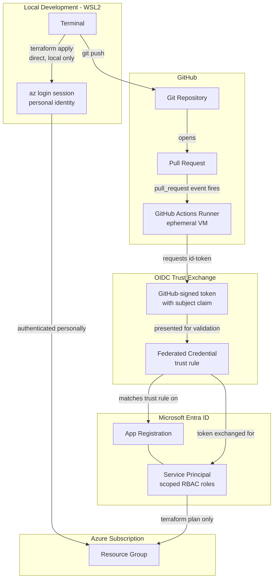

# Secretless CI/CD Pipeline

GitHub Actions authenticates to Azure using OpenID Connect (OIDC) federated identity — no client secret, API key, or long-lived credential stored anywhere in GitHub. This document covers that setup, the workflow itself, and several genuine findings encountered building it.

## Two Separate Paths to Azure

This build has two distinct identities reaching Azure, and it's worth being precise about which one actually did the work:

**Every actual `apply` in this entire project went through the top path** — a personal `az login` session. The bottom path, the OIDC/GitHub Actions identity, only ever ran `plan` — a deliberate choice, not a limitation, covered under Design Decisions below.

## OIDC Setup

Three Azure AD objects, each with a distinct job:

- **App registration** — the identity's definition (name, client ID). Inert on its own — no login capability until the next two pieces exist.
- **Service principal** — makes that identity usable within the subscription; what RBAC roles actually attach to.
- **Federated credentials (two)** — the actual trust rules, replacing what would otherwise be a stored secret. GitHub issues a short-lived, cryptographically signed token at the moment a workflow runs, scoped to a specific repository and event type; Azure AD validates it against these rules and exchanges it for real, temporary Azure access.

**Why two federated credentials, not one:** GitHub's signed token subject claim differs by trigger type, not just by branch:
- A push to `main` produces `repo:owner/repo:ref:refs/heads/main`
- A pull request produces `repo:owner/repo:pull_request` — a fixed subject with no branch name in it at all

A single credential scoped to the branch-push format would silently fail to authenticate a PR-triggered run, regardless of which branch the PR came from. Both were created explicitly.

**Least-privilege role assignment:** the service principal holds `Contributor` and `User Access Administrator`, scoped to the resource group only — not the subscription. `Contributor` alone was insufficient, since Azure deliberately excludes RBAC role-assignment management from that role, and this project's own Key Vault role assignments required the pipeline to be able to manage them.

## Workflow

Triggers on pull requests and pushes to `main`, filtered to changes under `terraform/`. Runs `terraform init`, `validate`, a Checkov policy scan, and `plan`, posting the plan output directly as a PR comment. `apply` is deliberately not automated — a considered decision given this project's short remaining lifespan and the value of a human reviewing real infrastructure changes before they happen, not an oversight or limitation of the setup.

## Findings

**GitHub's immutable OIDC subject-claim format.** The first real pipeline run failed authentication entirely, with an error showing GitHub's signed token used a different subject format than either federated credential was configured for — `owner@ownerID/repo@repoID` rather than the plain `owner/repo` most documentation (including the original setup here) still shows. This reflects a platform-level change GitHub has been rolling out to prevent subject-claim collisions after repo renames or ownership transfers. Both federated credentials were updated with the correct, immutable IDs once identified.

**`tfsec` is deprecated; `Trivy`, its replacement, had its own supply-chain compromise in 2026.** The originally planned scanning tool, `tfsec`, has been fully merged into Trivy and receives no further updates. Trivy itself was avoided here specifically because its official GitHub Action was subject to a documented supply-chain compromise (a malicious commit to the action) in March 2026 — using it safely would require pinning to a verified commit SHA rather than a version tag. Checkov, from an unrelated vendor lineage, was used instead.

**A JavaScript syntax error from splicing raw plan output into a template literal.** The PR-comment step initially failed with `SyntaxError: Unexpected identifier`, traced to a backtick character inside Terraform's own deprecation-warning text prematurely closing a JavaScript template string the plan output was spliced directly into. Fixed by passing the plan output through an environment variable (`process.env.PLAN`) instead of direct text substitution — treated as an ordinary string value rather than executable script source.

**An unresolved, likely-cosmetic exit-code quirk.** A subsequent run showed a fully valid, error-free `terraform plan` output (a real, correctly-formed diff and summary line) immediately followed by `Error: Terraform exited with code 1` and the job reporting failure — despite `continue-on-error: true` on the plan step, which should have let the job succeed regardless. This is consistent with a documented category of issue in how `hashicorp/setup-terraform`'s output-capturing wrapper script reports exit codes, though it wasn't possible to confirm the exact mechanism with full certainty. Noted here rather than presented as fully resolved, in keeping with this project's standard of not overstating confidence.

## Branch Protection

`main` is protected via a GitHub Ruleset requiring a pull request and a passing `Terraform Plan` check before merge. One genuine trap worth documenting: GitHub does not allow a pull request author to approve their own PR under any configuration — a hard platform rule, not a setting. On a solo-maintainer repository, enabling a required-approval count above zero without an admin exemption would lock the owner out of merging their own work entirely. This repo's ruleset keeps the required-approval count at zero for that reason, while still requiring the PR-and-passing-check flow, which is real work-blocking value regardless.

## Decommissioning

The Azure AD identity backing this pipeline (app registration, service principal, both federated credentials) was deleted as part of final teardown — but only *after* every remaining code change had already been merged. This ordering mattered in practice: an earlier attempt to merge one final configuration change after the identity was already deleted left the required `Terraform Plan` check permanently unable to run, since it depended on an identity that no longer existed. The check couldn't fail cleanly — it could only wait forever. Resolved by temporarily disabling branch protection to merge the last change, but the correct sequencing for any future teardown is straightforward: merge everything first, decommission the CI/CD identity last.
